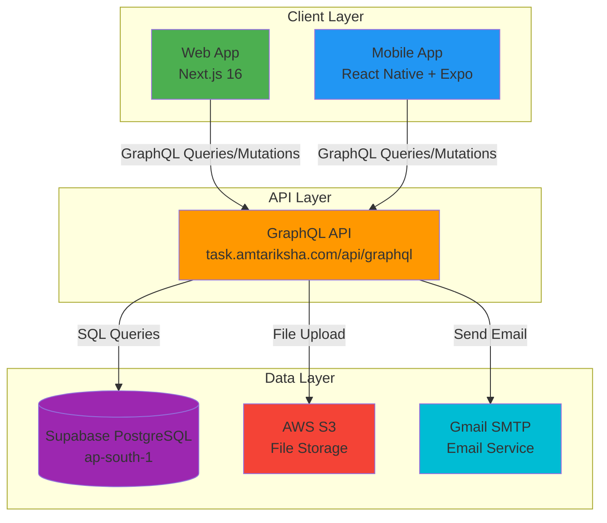
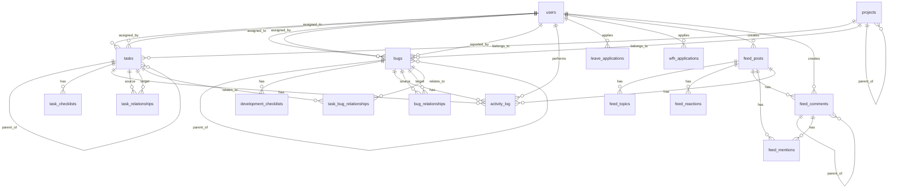

# JSR Task Management - System Architecture

**Last Updated:** 2025-11-12

## Changelog
- **2025-11-12**: Initial creation - Complete system architecture, database schema, GraphQL API documentation

---

## Table of Contents
1. [System Overview](#system-overview)
2. [Technology Stack](#technology-stack)
3. [Architecture Diagram](#architecture-diagram)
4. [Database Schema](#database-schema)
5. [GraphQL API](#graphql-api)
6. [Authentication & Authorization](#authentication--authorization)
7. [Key Features Implementation](#key-features-implementation)
8. [Mobile App Architecture](#mobile-app-architecture)
9. [Deployment Architecture](#deployment-architecture)

---

## System Overview

JSR Task Management is a full-stack task and project management system built as a monorepo using Turborepo. The system consists of:

- **Web Application**: Next.js 16 (App Router) with React 19
- **Mobile Application**: React Native + Expo SDK 54
- **Backend**: GraphQL API with Supabase PostgreSQL
- **Shared Packages**: TypeScript types and utilities

### Key Capabilities
- Task management with timers, subtasks, and checklists
- Bug tracking with attachments and subtasks
- Leave and WFH application workflows
- Social feed with posts, comments, reactions, and mentions
- Project hierarchy management
- Role-based access control (RBAC)
- Activity logging for all entities
- Email notifications via SMTP
- File uploads to AWS S3

---

## Technology Stack

### Frontend (Web)
- **Framework**: Next.js 16.0.0 (App Router, React Server Components)
- **React**: 19.0.0
- **GraphQL Client**: Apollo Client 3.11.11
- **UI Components**: Custom components with Tailwind CSS
- **Rich Text Editor**: Quill.js
- **State Management**: React Context + Apollo Cache
- **Deployment**: Vercel (auto-deployment enabled)

### Frontend (Mobile)
- **Framework**: React Native 0.81.5
- **Expo**: SDK 54
- **GraphQL Client**: Apollo Client 4.x
- **Navigation**: React Navigation
- **Deployment**: Standalone APK builds

### Backend
- **Database**: Supabase PostgreSQL (Project: rbckjkdohzbclomrufrx, Region: ap-south-1)
- **API**: GraphQL (custom implementation, not Hasura)
- **Authentication**: JWT tokens
- **File Storage**: AWS S3 (Bucket: amtariksha, Region: ap-south-1)
- **Email**: Gmail SMTP (smtp.gmail.com:465)

### Development Tools
- **Monorepo**: Turborepo
- **Package Manager**: npm
- **TypeScript**: Shared types in packages/shared
- **Version Control**: Git + GitHub

---

## Architecture Diagram



---

## Database Schema

### Core Tables

#### users
Stores user information and authentication credentials.

| Column | Type | Constraints | Description |
|--------|------|-------------|-------------|
| id | INTEGER | PRIMARY KEY | Auto-increment ID |
| employee_id | VARCHAR(50) | UNIQUE, NOT NULL | Employee identifier (e.g., AM-0001) |
| name | VARCHAR(255) | NOT NULL | Full name |
| email | VARCHAR(255) | UNIQUE, NOT NULL | Email address |
| phone | VARCHAR(20) | | Phone number |
| telegram_token | VARCHAR(255) | | Telegram bot token |
| department | VARCHAR(100) | NOT NULL | Department name |
| manager_id | VARCHAR(50) | | Manager's employee_id |
| manager_email | VARCHAR(255) | | Manager's email |
| role | VARCHAR(100) | DEFAULT 'employee' | Role: amtariksian, management, top_management, admin |
| password | VARCHAR(255) | NOT NULL | Hashed password |
| status | VARCHAR(100) | DEFAULT 'active' | User status |
| is_system_admin | INTEGER | DEFAULT 0 | System admin flag (0 or 1) |
| id_card_photo | VARCHAR(500) | | ID card photo URL |
| is_today_task | INTEGER | DEFAULT 0 | Today's task flag |
| warning_count | INTEGER | DEFAULT 0 | Warning count |
| hours_log | TEXT | | Hours log data |
| created_at | TIMESTAMP | DEFAULT CURRENT_TIMESTAMP | Creation timestamp |
| updated_at | TIMESTAMP | DEFAULT CURRENT_TIMESTAMP | Last update timestamp |

**Indexes:**
- `users_pkey` (id)
- `users_employee_id_key` (employee_id) UNIQUE
- `users_email_key` (email) UNIQUE
- `idx_email` (email)
- `idx_department` (department)
- `idx_role` (role)

**Note:** Role 'employee' has been renamed to 'amtariksian' in the application logic.

---

#### tasks
Stores task information with support for hierarchical tasks, multiple assignees, timers, and checklists.

| Column | Type | Constraints | Description |
|--------|------|-------------|-------------|
| id | INTEGER | PRIMARY KEY | Auto-increment ID |
| task_id | VARCHAR(100) | UNIQUE, NOT NULL | Task identifier (e.g., TSK-001) |
| internal_id | VARCHAR(100) | UNIQUE, NOT NULL | Internal identifier |
| name | VARCHAR(150) | NOT NULL | Task name/title |
| description | TEXT | NOT NULL | Detailed description |
| select_type | VARCHAR(100) | DEFAULT 'Normal' | Task type |
| recursive_type | VARCHAR(100) | | Recursive task type |
| assigned_to | JSONB | NOT NULL | Array of employee IDs (supports multiple assignees) |
| assigned_by | VARCHAR(50) | NOT NULL | Assigner's employee_id |
| support | JSONB | | Support team members |
| start_date | DATE | NOT NULL | Task start date |
| end_date | DATE | NOT NULL | Task end date |
| priority | VARCHAR(100) | DEFAULT 'NU&NI' | Priority level |
| estimated_hours | NUMERIC | DEFAULT 0.00 | Estimated hours |
| actual_hours | NUMERIC | DEFAULT 0.00 | Actual hours worked |
| daily_hours | JSONB | | Daily hours breakdown |
| status | VARCHAR(50) | DEFAULT 'Yet to Start' | Task status |
| remarks | TEXT | | Remarks/notes |
| difficulties | TEXT | | Difficulties encountered |
| related_tasks | VARCHAR(500) | | Comma-separated related task IDs |
| project_id | VARCHAR(50) | | Associated project ID |
| subproject_id | VARCHAR(50) | | Associated subproject ID |
| parent_task_id | VARCHAR(50) | FK to tasks(task_id) | Parent task for subtasks |
| department | VARCHAR(100) | | Department |
| timer_state | VARCHAR(50) | | Timer state: running, paused, stopped |
| timer_start_time | TIMESTAMP | | Timer start timestamp |
| timer_paused_time | INTEGER | | Paused time in seconds |
| timer_total_time | INTEGER | | Total time in seconds |
| timer_sessions | JSONB | | Array of timer sessions |
| created_at | TIMESTAMP | DEFAULT CURRENT_TIMESTAMP | Creation timestamp |
| updated_at | TIMESTAMP | DEFAULT CURRENT_TIMESTAMP | Last update timestamp |
| deleted_at | TIMESTAMP | | Soft delete timestamp |
| deleted_by | VARCHAR(50) | | Deleter's employee_id |

**Indexes:**
- `tasks_pkey` (id)
- `tasks_task_id_key` (task_id) UNIQUE
- `tasks_internal_id_key` (internal_id) UNIQUE
- `idx_tasks_assigned_to_gin` (assigned_to) GIN index for JSONB
- `idx_tasks_name` (name)
- `idx_tasks_parent_task_id` (parent_task_id) WHERE parent_task_id IS NOT NULL
- `idx_tasks_subproject_id` (subproject_id)
- `idx_tasks_timer_state` (timer_state)
- `idx_tasks_timer_start_time` (timer_start_time)
- `idx_assigned_by` (assigned_by)
- `idx_start_date` (start_date)
- `idx_end_date` (end_date)
- `idx_related_tasks` (related_tasks)

**Foreign Keys:**
- `tasks_parent_task_id_fkey`: parent_task_id → tasks(task_id)

**Business Rules:**
- Timers MUST NOT show for tasks with status 'Closed' or 'Resolved'
- assigned_to is JSONB array to support multiple assignees
- parent_task_id creates hierarchical task structure (subtasks)

---

#### bugs
Stores bug/development item information with attachments, subtasks, and timer support.

| Column | Type | Constraints | Description |
|--------|------|-------------|-------------|
| id | INTEGER | PRIMARY KEY | Auto-increment ID |
| bug_id | VARCHAR(100) | UNIQUE, NOT NULL | Bug identifier (e.g., BUG-001, DEV-001) |
| title | VARCHAR(500) | NOT NULL | Bug title |
| description | TEXT | NOT NULL | Detailed description |
| type | VARCHAR(100) | | Bug type (Bug, Development, etc.) |
| severity | VARCHAR(50) | DEFAULT 'Minor' | Severity level |
| priority | VARCHAR(50) | DEFAULT 'Low' | Priority level |
| status | VARCHAR(50) | DEFAULT 'New' | Bug status |
| category | VARCHAR(100) | DEFAULT 'Other' | Bug category |
| platform | VARCHAR(50) | DEFAULT 'Web' | Platform (Web, Mobile, API, etc.) |
| assigned_to | VARCHAR(50) | | Assignee's employee_id |
| assigned_by | VARCHAR(50) | | Assigner's employee_id |
| reported_by | VARCHAR(50) | NOT NULL | Reporter's employee_id |
| environment | VARCHAR(50) | DEFAULT 'Production' | Environment |
| browser_info | VARCHAR(255) | | Browser information |
| device_info | VARCHAR(255) | | Device information |
| steps_to_reproduce | TEXT | | Steps to reproduce |
| expected_behavior | TEXT | | Expected behavior |
| actual_behavior | TEXT | | Actual behavior |
| attachments | TEXT | | JSON array of S3 URLs |
| estimated_hours | NUMERIC | | Estimated hours |
| actual_hours | NUMERIC | | Actual hours worked |
| resolved_date | TIMESTAMP | | Resolution timestamp |
| closed_date | TIMESTAMP | | Closure timestamp |
| reopened_count | INTEGER | DEFAULT 0 | Number of times reopened |
| tags | VARCHAR(500) | | Comma-separated tags |
| related_bugs | VARCHAR(500) | | Comma-separated related bug IDs |
| project_id | VARCHAR(50) | | Associated project ID |
| subproject_id | VARCHAR(50) | | Associated subproject ID |
| feature | VARCHAR(255) | | Feature name |
| parent_dev_id | VARCHAR(50) | FK to bugs(bug_id) | Parent development item |
| development_prompt | TEXT | | Development prompt/requirements |
| server_logs | TEXT | | Server logs |
| frontend_logs | TEXT | | Frontend logs |
| start_date | DATE | | Start date |
| end_date | DATE | | End date |
| timer_state | VARCHAR(50) | | Timer state |
| timer_start_time | TIMESTAMP | | Timer start timestamp |
| timer_paused_time | INTEGER | | Paused time in seconds |
| timer_total_time | INTEGER | | Total time in seconds |
| timer_sessions | JSONB | | Array of timer sessions |
| created_at | TIMESTAMP | DEFAULT CURRENT_TIMESTAMP | Creation timestamp |
| updated_at | TIMESTAMP | DEFAULT CURRENT_TIMESTAMP | Last update timestamp |
| deleted_at | TIMESTAMP | | Soft delete timestamp |
| deleted_by | VARCHAR(50) | | Deleter's employee_id |

**Indexes:**
- `bugs_pkey` (id)
- `bugs_bug_id_key` (bug_id) UNIQUE
- `idx_bugs_parent_dev_id` (parent_dev_id) WHERE parent_dev_id IS NOT NULL
- `idx_bugs_timer_state` (timer_state)
- `idx_bugs_timer_start_time` (timer_start_time)
- `idx_category` (category)
- `idx_platform` (platform)
- `idx_priority` (priority)
- `idx_project_id` (project_id)
- `idx_reported_by` (reported_by)
- `idx_severity` (severity)
- `idx_subproject_id` (subproject_id)
- `idx_type` (type)
- `assigned_by` (assigned_by)

**Foreign Keys:**
- `bugs_parent_dev_id_fkey`: parent_dev_id → bugs(bug_id)

---

#### projects
Stores project hierarchy with support for parent-child relationships.

| Column | Type | Constraints | Description |
|--------|------|-------------|-------------|
| id | INTEGER | PRIMARY KEY | Auto-increment ID |
| project_id | VARCHAR(50) | UNIQUE, NOT NULL | Project identifier |
| project_name | VARCHAR(255) | NOT NULL | Project name |
| description | TEXT | | Project description |
| parent_project_id | VARCHAR(50) | | Parent project ID (for subprojects) |
| status | VARCHAR(50) | DEFAULT 'Active' | Project status |
| start_date | DATE | | Project start date |
| end_date | DATE | | Project end date |
| created_by | VARCHAR(50) | NOT NULL | Creator's employee_id |
| created_at | TIMESTAMP | DEFAULT CURRENT_TIMESTAMP | Creation timestamp |
| updated_at | TIMESTAMP | DEFAULT CURRENT_TIMESTAMP | Last update timestamp |
| deleted_at | TIMESTAMP | | Soft delete timestamp |
| deleted_by | VARCHAR(50) | | Deleter's employee_id |

**Indexes:**
- `projects_pkey` (id)
- `projects_project_id_key` (project_id) UNIQUE
- `idx_parent_project_id` (parent_project_id)
- `idx_created_by` (created_by)
- `deleted_by` (deleted_by)

---

#### activity_log
Stores all activity and comments for tasks, bugs, and other entities.

| Column | Type | Constraints | Description |
|--------|------|-------------|-------------|
| id | INTEGER | PRIMARY KEY | Auto-increment ID |
| entity_type | VARCHAR(50) | NOT NULL | Entity type (task, bug, leave, wfh, etc.) |
| entity_id | VARCHAR(100) | NOT NULL | Entity identifier |
| user_id | VARCHAR(50) | NOT NULL, FK to users(employee_id) | User who performed action |
| action_type | VARCHAR(50) | NOT NULL | Action type (created, updated, comment, etc.) |
| field_name | VARCHAR(100) | | Field that was changed |
| old_value | TEXT | | Previous value |
| new_value | TEXT | | New value |
| description | TEXT | NOT NULL | Activity description |
| is_comment | SMALLINT | DEFAULT 0 | 1 if this is a comment, 0 otherwise |
| attachments | TEXT | | JSON array of attachment URLs |
| time_format_migrated | BOOLEAN | DEFAULT false | Migration flag |
| created_at | TIMESTAMP | DEFAULT CURRENT_TIMESTAMP | Activity timestamp |

**Indexes:**
- `activity_log_pkey` (id)
- `idx_activity_log_entity` (entity_type, entity_id)
- `idx_activity_log_entity_created` (entity_type, entity_id, created_at)
- `idx_activity_log_user_id` (user_id)
- `idx_activity_log_action_type` (action_type)
- `idx_activity_log_is_comment` (is_comment)
- `idx_activity_log_created_at` (created_at)

**Foreign Keys:**
- `fk_activity_log_user_id`: user_id → users(employee_id)

**Business Rules:**
- Comments are stored with `is_comment = 1` and `action_type = 'comment'`
- Activity filtering: Comments filter shows `action_type='comment'`, Activity filter shows `action_type!='comment'`
- Default state: showActivity=false, showComments=true (comments only by default)

---

#### task_checklists
Stores checklist items for tasks (lightweight subtasks).

| Column | Type | Constraints | Description |
|--------|------|-------------|-------------|
| id | INTEGER | PRIMARY KEY | Auto-increment ID |
| parent_task_id | VARCHAR(100) | NOT NULL, FK to tasks(task_id) | Parent task ID |
| description | TEXT | NOT NULL | Checklist item description |
| assigned_to | VARCHAR(50) | NOT NULL | Assignee's employee_id |
| status | VARCHAR(100) | DEFAULT 'Not Started' | Checklist status |
| is_completed | INTEGER | DEFAULT 0 | Completion flag (0 or 1) |
| display_order | INTEGER | DEFAULT 0 | Display order |
| created_by | VARCHAR(50) | NOT NULL | Creator's employee_id |
| created_at | TIMESTAMP | DEFAULT CURRENT_TIMESTAMP | Creation timestamp |
| updated_at | TIMESTAMP | DEFAULT CURRENT_TIMESTAMP | Last update timestamp |
| deleted_at | TIMESTAMP | | Soft delete timestamp |
| deleted_by | VARCHAR(50) | | Deleter's employee_id |

**Indexes:**
- `subtasks_pkey` (id)
- `idx_parent_task_id` (parent_task_id)

**Foreign Keys:**
- `task_checklists_parent_task_id_fkey`: parent_task_id → tasks(task_id)

**Note:** Checklists are different from Subtasks. Checklists are lightweight items, while Subtasks are full tasks with parent_task_id.

---

#### development_checklists
Stores checklist items for bugs/development items.

| Column | Type | Constraints | Description |
|--------|------|-------------|-------------|
| id | INTEGER | PRIMARY KEY | Auto-increment ID |
| parent_bug_id | VARCHAR(100) | NOT NULL, FK to bugs(bug_id) | Parent bug ID |
| description | TEXT | NOT NULL | Checklist item description |
| assigned_to | VARCHAR(50) | NOT NULL | Assignee's employee_id |
| status | VARCHAR(100) | DEFAULT 'Not Started' | Checklist status |
| is_completed | INTEGER | DEFAULT 0 | Completion flag (0 or 1) |
| display_order | INTEGER | DEFAULT 0 | Display order |
| created_by | VARCHAR(50) | NOT NULL | Creator's employee_id |
| created_at | TIMESTAMP | DEFAULT CURRENT_TIMESTAMP | Creation timestamp |
| updated_at | TIMESTAMP | DEFAULT CURRENT_TIMESTAMP | Last update timestamp |
| deleted_at | TIMESTAMP | | Soft delete timestamp |
| deleted_by | VARCHAR(50) | | Deleter's employee_id |

**Indexes:**
- `bug_subtasks_pkey` (id)
- `idx_parent_bug_id` (parent_bug_id)
- `idx_assigned_to` (assigned_to)
- `idx_status` (status)
- `idx_is_completed` (is_completed)
- `idx_display_order` (display_order)
- `idx_deleted_at` (deleted_at)

**Foreign Keys:**
- `development_checklists_parent_dev_id_fkey`: parent_bug_id → bugs(bug_id)

---

### Relationship Tables

#### task_relationships
Stores relationships between tasks (related, blocks, depends on, etc.).

| Column | Type | Constraints | Description |
|--------|------|-------------|-------------|
| id | INTEGER | PRIMARY KEY | Auto-increment ID |
| source_task_id | VARCHAR(50) | NOT NULL, FK to tasks(task_id) | Source task ID |
| target_task_id | VARCHAR(50) | NOT NULL, FK to tasks(task_id) | Target task ID |
| relationship_type | VARCHAR(20) | NOT NULL | Relationship type |
| created_by | VARCHAR(50) | NOT NULL | Creator's employee_id |
| created_at | TIMESTAMP | DEFAULT CURRENT_TIMESTAMP | Creation timestamp |

**Indexes:**
- `task_relationships_pkey` (id)
- `task_relationships_unique` (source_task_id, target_task_id, relationship_type) UNIQUE
- `idx_task_relationships_source` (source_task_id)
- `idx_task_relationships_target` (target_task_id)
- `idx_task_relationships_type` (relationship_type)

**Foreign Keys:**
- `task_relationships_source_fkey`: source_task_id → tasks(task_id)
- `task_relationships_target_fkey`: target_task_id → tasks(task_id)

---

#### bug_relationships
Stores relationships between bugs.

| Column | Type | Constraints | Description |
|--------|------|-------------|-------------|
| id | INTEGER | PRIMARY KEY | Auto-increment ID |
| source_bug_id | VARCHAR(50) | NOT NULL, FK to bugs(bug_id) | Source bug ID |
| target_bug_id | VARCHAR(50) | NOT NULL, FK to bugs(bug_id) | Target bug ID |
| relationship_type | VARCHAR(20) | NOT NULL | Relationship type |
| created_by | VARCHAR(50) | NOT NULL | Creator's employee_id |
| created_at | TIMESTAMP | DEFAULT CURRENT_TIMESTAMP | Creation timestamp |

**Indexes:**
- `bug_relationships_pkey` (id)
- `bug_relationships_unique` (source_bug_id, target_bug_id, relationship_type) UNIQUE
- `idx_bug_relationships_source` (source_bug_id)
- `idx_bug_relationships_target` (target_bug_id)
- `idx_bug_relationships_type` (relationship_type)

**Foreign Keys:**
- `bug_relationships_source_fkey`: source_bug_id → bugs(bug_id)
- `bug_relationships_target_fkey`: target_bug_id → bugs(bug_id)

---

#### task_bug_relationships
Stores relationships between tasks and bugs.

| Column | Type | Constraints | Description |
|--------|------|-------------|-------------|
| id | INTEGER | PRIMARY KEY | Auto-increment ID |
| task_id | VARCHAR(50) | NOT NULL, FK to tasks(task_id) | Task ID |
| bug_id | VARCHAR(50) | NOT NULL, FK to bugs(bug_id) | Bug ID |
| relationship_type | VARCHAR(20) | NOT NULL | Relationship type |
| created_by | VARCHAR(50) | NOT NULL | Creator's employee_id |
| created_at | TIMESTAMP | DEFAULT CURRENT_TIMESTAMP | Creation timestamp |

**Indexes:**
- `task_bug_relationships_pkey` (id)
- `task_bug_relationships_unique` (task_id, bug_id, relationship_type) UNIQUE
- `idx_task_bug_relationships_task` (task_id)
- `idx_task_bug_relationships_bug` (bug_id)
- `idx_task_bug_relationships_type` (relationship_type)

**Foreign Keys:**
- `task_bug_relationships_task_fkey`: task_id → tasks(task_id)
- `task_bug_relationships_bug_fkey`: bug_id → bugs(bug_id)

---

### Feed System Tables

#### feed_posts
Stores social feed posts with rich content.

| Column | Type | Constraints | Description |
|--------|------|-------------|-------------|
| id | INTEGER | PRIMARY KEY | Auto-increment ID |
| post_id | VARCHAR(100) | UNIQUE, NOT NULL | Post identifier |
| content | TEXT | NOT NULL | Post content (HTML) |
| created_by | VARCHAR(50) | NOT NULL | Creator's employee_id |
| visibility | VARCHAR(50) | DEFAULT 'public' | Visibility level |
| is_pinned | INTEGER | DEFAULT 0 | Pinned flag (0 or 1) |
| created_at | TIMESTAMP | DEFAULT CURRENT_TIMESTAMP | Creation timestamp |
| updated_at | TIMESTAMP | DEFAULT CURRENT_TIMESTAMP | Last update timestamp |
| deleted_at | TIMESTAMP | | Soft delete timestamp |
| deleted_by | VARCHAR(50) | | Deleter's employee_id |

**Indexes:**
- `feed_posts_pkey` (id)
- `feed_posts_post_id_key` (post_id) UNIQUE
- `idx_feed_posts_created_by` (created_by)
- `idx_feed_posts_created_at` (created_at)
- `idx_feed_posts_is_pinned` (is_pinned)

---

#### feed_topics
Stores topics/tags for feed posts.

| Column | Type | Constraints | Description |
|--------|------|-------------|-------------|
| id | INTEGER | PRIMARY KEY | Auto-increment ID |
| post_id | VARCHAR(100) | NOT NULL, FK to feed_posts(post_id) | Post ID |
| topic_name | VARCHAR(100) | NOT NULL | Topic name |
| created_at | TIMESTAMP | DEFAULT CURRENT_TIMESTAMP | Creation timestamp |

**Indexes:**
- `feed_topics_pkey` (id)
- `idx_feed_topics_post_id` (post_id)
- `idx_feed_topics_topic_name` (topic_name)

**Foreign Keys:**
- `feed_topics_post_id_fkey`: post_id → feed_posts(post_id)

---

#### feed_reactions
Stores reactions (likes, etc.) on feed posts.

| Column | Type | Constraints | Description |
|--------|------|-------------|-------------|
| id | INTEGER | PRIMARY KEY | Auto-increment ID |
| post_id | VARCHAR(100) | NOT NULL, FK to feed_posts(post_id) | Post ID |
| user_id | VARCHAR(50) | NOT NULL | User's employee_id |
| reaction_type | VARCHAR(50) | NOT NULL | Reaction type (like, love, etc.) |
| created_at | TIMESTAMP | DEFAULT CURRENT_TIMESTAMP | Creation timestamp |

**Indexes:**
- `feed_reactions_pkey` (id)
- `feed_reactions_unique` (post_id, user_id, reaction_type) UNIQUE
- `idx_feed_reactions_post_id` (post_id)
- `idx_feed_reactions_user_id` (user_id)

**Foreign Keys:**
- `feed_reactions_post_id_fkey`: post_id → feed_posts(post_id)

---

#### feed_comments
Stores comments on feed posts.

| Column | Type | Constraints | Description |
|--------|------|-------------|-------------|
| id | INTEGER | PRIMARY KEY | Auto-increment ID |
| comment_id | VARCHAR(100) | UNIQUE, NOT NULL | Comment identifier |
| post_id | VARCHAR(100) | NOT NULL, FK to feed_posts(post_id) | Post ID |
| content | TEXT | NOT NULL | Comment content |
| created_by | VARCHAR(50) | NOT NULL | Creator's employee_id |
| parent_comment_id | VARCHAR(100) | | Parent comment ID (for replies) |
| created_at | TIMESTAMP | DEFAULT CURRENT_TIMESTAMP | Creation timestamp |
| updated_at | TIMESTAMP | DEFAULT CURRENT_TIMESTAMP | Last update timestamp |
| deleted_at | TIMESTAMP | | Soft delete timestamp |
| deleted_by | VARCHAR(50) | | Deleter's employee_id |

**Indexes:**
- `feed_comments_pkey` (id)
- `feed_comments_comment_id_key` (comment_id) UNIQUE
- `idx_feed_comments_post_id` (post_id)
- `idx_feed_comments_created_by` (created_by)
- `idx_feed_comments_parent_comment_id` (parent_comment_id)

**Foreign Keys:**
- `feed_comments_post_id_fkey`: post_id → feed_posts(post_id)

---

#### feed_mentions
Stores user mentions in feed posts and comments.

| Column | Type | Constraints | Description |
|--------|------|-------------|-------------|
| id | INTEGER | PRIMARY KEY | Auto-increment ID |
| entity_type | VARCHAR(50) | NOT NULL | Entity type (post, comment) |
| entity_id | VARCHAR(100) | NOT NULL | Entity ID |
| mentioned_user_id | VARCHAR(50) | NOT NULL | Mentioned user's employee_id |
| created_at | TIMESTAMP | DEFAULT CURRENT_TIMESTAMP | Creation timestamp |

**Indexes:**
- `feed_mentions_pkey` (id)
- `idx_feed_mentions_entity` (entity_type, entity_id)
- `idx_feed_mentions_user` (mentioned_user_id)

---

### Leave and WFH Tables

#### leave_applications
Stores leave applications with approval workflow.

| Column | Type | Constraints | Description |
|--------|------|-------------|-------------|
| id | INTEGER | PRIMARY KEY | Auto-increment ID |
| leave_id | VARCHAR(100) | UNIQUE, NOT NULL | Leave identifier |
| employee_id | VARCHAR(50) | NOT NULL | Applicant's employee_id |
| leave_type | VARCHAR(100) | NOT NULL | Leave type (Sick, Casual, etc.) |
| start_date | DATE | NOT NULL | Leave start date |
| end_date | DATE | NOT NULL | Leave end date |
| total_days | NUMERIC | NOT NULL | Total leave days |
| reason | TEXT | NOT NULL | Leave reason |
| status | VARCHAR(50) | DEFAULT 'Pending' | Application status |
| applied_date | TIMESTAMP | DEFAULT CURRENT_TIMESTAMP | Application timestamp |
| approved_by | VARCHAR(50) | | Approver's employee_id |
| approved_date | TIMESTAMP | | Approval timestamp |
| rejection_reason | TEXT | | Rejection reason |
| created_at | TIMESTAMP | DEFAULT CURRENT_TIMESTAMP | Creation timestamp |
| updated_at | TIMESTAMP | DEFAULT CURRENT_TIMESTAMP | Last update timestamp |
| deleted_at | TIMESTAMP | | Soft delete timestamp |
| deleted_by | VARCHAR(50) | | Deleter's employee_id |

**Indexes:**
- `leave_applications_pkey` (id)
- `leave_applications_leave_id_key` (leave_id) UNIQUE
- `idx_leave_applications_employee_id` (employee_id)
- `idx_leave_applications_status` (status)
- `idx_leave_applications_start_date` (start_date)
- `idx_leave_applications_end_date` (end_date)

---

#### wfh_applications
Stores work-from-home applications with approval workflow.

| Column | Type | Constraints | Description |
|--------|------|-------------|-------------|
| id | INTEGER | PRIMARY KEY | Auto-increment ID |
| wfh_id | VARCHAR(100) | UNIQUE, NOT NULL | WFH identifier |
| employee_id | VARCHAR(50) | NOT NULL | Applicant's employee_id |
| wfh_date | DATE | NOT NULL | WFH date |
| reason | TEXT | NOT NULL | WFH reason |
| status | VARCHAR(50) | DEFAULT 'Pending' | Application status |
| applied_date | TIMESTAMP | DEFAULT CURRENT_TIMESTAMP | Application timestamp |
| approved_by | VARCHAR(50) | | Approver's employee_id |
| approved_date | TIMESTAMP | | Approval timestamp |
| rejection_reason | TEXT | | Rejection reason |
| created_at | TIMESTAMP | DEFAULT CURRENT_TIMESTAMP | Creation timestamp |
| updated_at | TIMESTAMP | DEFAULT CURRENT_TIMESTAMP | Last update timestamp |
| deleted_at | TIMESTAMP | | Soft delete timestamp |
| deleted_by | VARCHAR(50) | | Deleter's employee_id |

**Indexes:**
- `wfh_applications_pkey` (id)
- `wfh_applications_wfh_id_key` (wfh_id) UNIQUE
- `idx_wfh_applications_employee_id` (employee_id)
- `idx_wfh_applications_status` (status)
- `idx_wfh_applications_wfh_date` (wfh_date)

---

### Configuration Tables

#### settings
Stores system-wide configuration settings.

| Column | Type | Constraints | Description |
|--------|------|-------------|-------------|
| id | INTEGER | PRIMARY KEY | Auto-increment ID |
| setting_key | VARCHAR(255) | UNIQUE, NOT NULL | Setting key |
| setting_value | TEXT | | Setting value |
| description | TEXT | | Setting description |
| metadata | JSONB | | Additional metadata |
| created_at | TIMESTAMP | DEFAULT CURRENT_TIMESTAMP | Creation timestamp |
| updated_at | TIMESTAMP | DEFAULT CURRENT_TIMESTAMP | Last update timestamp |

**Indexes:**
- `settings_pkey` (id)
- `settings_setting_key_key` (setting_key) UNIQUE

**Example Settings:**
- Collapsible text thresholds (300 characters OR 5 lines)
- Expand/collapse button position (right-aligned)
- Persist state preferences per page/component

---

## Entity Relationship Diagram



---

## GraphQL API

**Last Updated:** 2025-11-12

### Endpoint
- **URL**: `https://task.amtariksha.com/api/graphql`
- **Method**: POST
- **Content-Type**: application/json

### Authentication
All requests require JWT token in Authorization header:
```
Authorization: Bearer <jwt_token>
```

### Key Queries

#### getTasks
Fetch tasks with filtering and pagination.

```graphql
query GetTasks(
  $assignedTo: String
  $status: String
  $priority: String
  $limit: Int
  $offset: Int
) {
  tasks(
    assignedTo: $assignedTo
    status: $status
    priority: $priority
    limit: $limit
    offset: $offset
  ) {
    taskId
    name
    description
    status
    priority
    startDate
    endDate
    estimatedHours
    actualHours
    assignedTo
    assignedBy
    assignedToUsers {
      employeeId
      name
      email
    }
    assignedByUser {
      employeeId
      name
      email
    }
    project {
      projectId
      projectName
      parentProjectId
    }
    timerState
    timerStartTime
    timerTotalTime
    createdAt
    updatedAt
  }
}
```

#### getBugs
Fetch bugs with filtering and pagination.

```graphql
query GetBugs(
  $assignedTo: String
  $status: String
  $priority: String
  $severity: String
  $limit: Int
  $offset: Int
) {
  bugs(
    assignedTo: $assignedTo
    status: $status
    priority: $priority
    severity: $severity
    limit: $limit
    offset: $offset
  ) {
    bugId
    title
    description
    type
    severity
    priority
    status
    category
    platform
    assignedTo
    assignedBy
    reportedBy
    assignedToUser {
      employeeId
      name
      email
    }
    assignedByUser {
      employeeId
      name
      email
    }
    reportedByUser {
      employeeId
      name
      email
    }
    project {
      projectId
      projectName
      parentProjectId
    }
    attachments
    estimatedHours
    actualHours
    timerState
    timerStartTime
    timerTotalTime
    createdAt
    updatedAt
  }
}
```

#### getFeedPosts
Fetch feed posts with topics, reactions, and comments.

```graphql
query GetFeedPosts($limit: Int, $offset: Int) {
  feedPosts(limit: $limit, offset: $offset) {
    posts {
      postId
      content
      createdBy
      visibility
      isPinned
      createdAt
      updatedAt
      author {
        employeeId
        name
        email
      }
      topics {
        topicName
      }
      reactions {
        reactionType
        userId
      }
      comments {
        commentId
        content
        createdBy
        createdAt
      }
    }
    totalCount
  }
}
```

### Key Mutations

#### createTask
Create a new task.

```graphql
mutation CreateTask($input: TaskInput!) {
  createTask(input: $input) {
    taskId
    name
    description
    status
    priority
    assignedTo
    assignedBy
    startDate
    endDate
    estimatedHours
    projectId
    createdAt
  }
}
```

#### updateTask
Update an existing task.

```graphql
mutation UpdateTask($taskId: String!, $input: TaskInput!) {
  updateTask(taskId: $taskId, input: $input) {
    taskId
    name
    description
    status
    priority
    actualHours
    updatedAt
  }
}
```

#### startTimer / pauseTimer / stopTimer
Control task/bug timers.

```graphql
mutation StartTimer($entityType: String!, $entityId: String!) {
  startTimer(entityType: $entityType, entityId: $entityId) {
    success
    message
    timerState
    timerStartTime
  }
}

mutation PauseTimer($entityType: String!, $entityId: String!) {
  pauseTimer(entityType: $entityType, entityId: $entityId) {
    success
    message
    timerState
    timerPausedTime
  }
}

mutation StopTimer($entityType: String!, $entityId: String!) {
  stopTimer(entityType: $entityType, entityId: $entityId) {
    success
    message
    timerState
    timerTotalTime
    actualHours
  }
}
```

### Field Resolvers

GraphQL uses field resolvers to fetch related data efficiently:

- **project**: Resolves project details from project_id
- **assignedToUsers**: Resolves user details from assigned_to array (for tasks)
- **assignedByUser**: Resolves user details from assigned_by
- **assignedToUser**: Resolves user details from assigned_to (for bugs)
- **reportedByUser**: Resolves user details from reported_by
- **author**: Resolves user details from created_by (for feed posts)
- **topics**: Resolves topics from feed_topics table
- **reactions**: Resolves reactions from feed_reactions table
- **comments**: Resolves comments from feed_comments table

**DataLoader Pattern**: Web app uses DataLoader for batching and caching project queries to prevent N+1 query problems.

---

## Authentication & Authorization

**Last Updated:** 2025-11-12

### Authentication Flow

1. **Login**: User submits employee_id and password
2. **Validation**: Server validates credentials against users table
3. **JWT Generation**: Server generates JWT token with user info
4. **Token Storage**: Client stores token in localStorage (web) or AsyncStorage (mobile)
5. **Authenticated Requests**: Client includes token in Authorization header

### JWT Payload
```json
{
  "employeeId": "AM-0001",
  "name": "John Doe",
  "email": "john@example.com",
  "role": "admin",
  "department": "Engineering",
  "iat": 1699876543,
  "exp": 1699962943
}
```

### Role-Based Access Control (RBAC)

**Roles** (in order of privilege):
1. **amtariksian** (formerly 'employee') - Basic user
2. **management** - Team lead/manager
3. **top_management** - Senior management
4. **admin** - System administrator

**Permission Matrix:**

| Feature | amtariksian | management | top_management | admin |
|---------|-------------|------------|----------------|-------|
| View own tasks | ✅ | ✅ | ✅ | ✅ |
| View team tasks | ❌ | ✅ | ✅ | ✅ |
| View all tasks | ❌ | ❌ | ✅ | ✅ |
| Create tasks | ✅ | ✅ | ✅ | ✅ |
| Edit own tasks | ✅ | ✅ | ✅ | ✅ |
| Edit team tasks | ❌ | ✅ | ✅ | ✅ |
| Delete tasks | ❌ | ❌ | ✅ | ✅ |
| Approve leave | ❌ | ✅ | ✅ | ✅ |
| Manage users | ❌ | ❌ | ❌ | ✅ |
| System settings | ❌ | ❌ | ❌ | ✅ |

---

## Key Features Implementation

**Last Updated:** 2025-11-12

### Timer System

**Architecture:**
- Timer state stored in database (timer_state, timer_start_time, timer_paused_time, timer_total_time)
- Timer sessions stored as JSONB array
- Activity log tracks all timer events (start, pause, resume, stop)

**Business Rules:**
- Timers MUST NOT show for tasks/bugs with status 'Closed' or 'Resolved'
- Only one timer can run per user at a time
- Stopping timer updates actual_hours field
- Timer sessions include start_time, end_time, duration

**States:**
- `running`: Timer is actively running
- `paused`: Timer is paused
- `stopped`: Timer is stopped
- `null`: No timer activity

### Activity Logging

**Architecture:**
- Unified activity_log table for all entities
- is_comment flag distinguishes comments (1) from activities (0)
- Tracks field-level changes (old_value, new_value)

**Default Behavior:**
- Comments filter: `action_type='comment'` (showComments=true by default)
- Activity filter: `action_type!='comment'` (showActivity=false by default)

### Multiple Assignees (Tasks)

**Implementation:**
- tasks.assigned_to is JSONB array: `["AM-0001", "AM-0002"]`
- GraphQL resolver assignedToUsers fetches user details for each ID
- Supports assigning tasks to multiple team members

### Hierarchical Tasks/Bugs

**Implementation:**
- tasks.parent_task_id → tasks.task_id (self-referencing)
- bugs.parent_dev_id → bugs.bug_id (self-referencing)
- Supports unlimited nesting depth
- Checklists are separate (task_checklists, development_checklists)

### File Uploads (AWS S3)

**Configuration:**
- Bucket: amtariksha
- Region: ap-south-1 (AWS Mumbai)
- CORS enabled for browser uploads
- Public read access for attachments

**Upload Flow:**
1. Client requests pre-signed URL from GraphQL API
2. Server generates pre-signed URL with S3 SDK
3. Client uploads file directly to S3
4. Client saves S3 URL to database (bugs.attachments, activity_log.attachments)

### Email Notifications

**Configuration:**
- SMTP: smtp.gmail.com:465 (SSL)
- User: amtariksha@gmail.com
- App Password: wyfpzylmppjnhyfd

**Triggers:**
- Task assignment
- Leave application submitted/approved/rejected
- WFH application submitted/approved/rejected
- Mentions in feed posts/comments

---

## Mobile App Architecture

**Last Updated:** 2025-11-12

### Technology Stack
- React Native 0.81.5
- Expo SDK 54
- Apollo Client 4.x
- React Navigation

### Apollo Client 4.x Import Pattern

**CRITICAL**: React hooks MUST be imported from `@apollo/client/react`:

```typescript
// ✅ CORRECT
import { useQuery, useMutation, useLazyQuery } from '@apollo/client/react';
import { ApolloClient, InMemoryCache, HttpLink } from '@apollo/client';

// ❌ WRONG
import { useQuery, useMutation } from '@apollo/client';
```

### Build Process

**Debug APK:**
```bash
cd apps/mobile/android
./gradlew assembleDebug --no-daemon
```

**APK Location:**
```
apps/mobile/android/app/build/outputs/apk/debug/app-debug.apk
```

**Installation:**
```bash
adb install -r app/build/outputs/apk/debug/app-debug.apk
```

### Cache Clearing

**Metro Bundler:**
```bash
cd apps/mobile
npm start -- --reset-cache
```

**Expo Export:**
```bash
npx expo export:embed --platform android --reset-cache
```

---

## Deployment Architecture

**Last Updated:** 2025-11-12

### Web App (Vercel)
- **Platform**: Vercel
- **Auto-deployment**: Enabled (pushes to main branch)
- **Domain**: task.amtariksha.com
- **Environment Variables**: Set in Vercel dashboard (JWT_SECRET, DATABASE_URL, SMTP config, AWS credentials)

### Database (Supabase)
- **Project ID**: rbckjkdohzbclomrufrx
- **Region**: ap-south-1 (AWS Mumbai)
- **Connection Pool**: Max 50 connections
- **Backup**: Automatic daily backups

### File Storage (AWS S3)
- **Bucket**: amtariksha
- **Region**: ap-south-1 (AWS Mumbai)
- **Access**: Public read, authenticated write
- **CORS**: Enabled for browser uploads

### Mobile App
- **Distribution**: Standalone APK builds
- **Testing**: Manual installation via ADB
- **Production**: Future: Google Play Store

---

**For quick reference, see QUICK_REFERENCE.md**
**For development patterns, see DEVELOPER_GUIDE.md (coming soon)**
**For system requirements, see SRS.md (coming soon)**


